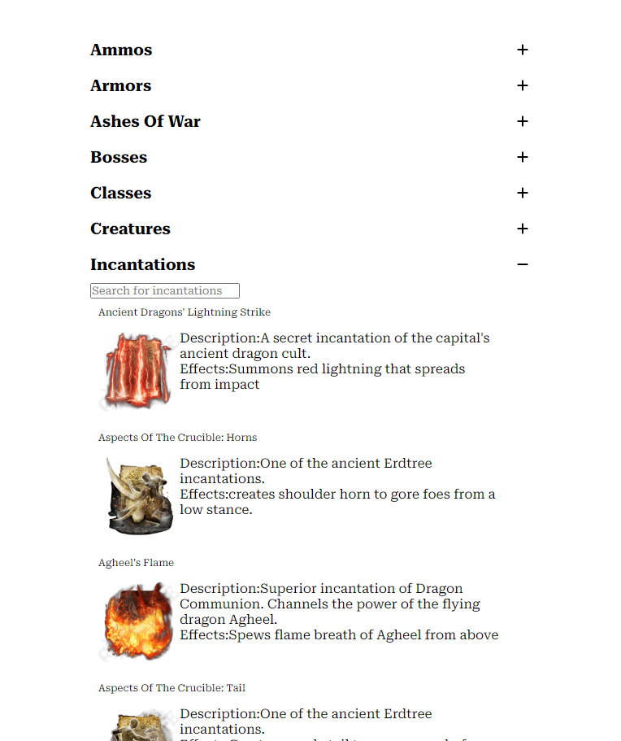

# ELDEN INFO

### `About` 
A simple application which allows you to search Elden ring information using an API. This was mainly to show case the use of persisted data and redux toolkit.


### `Run elden info` 

* cd into app

```
cd my-app
```
* install dependancies

```
npm install
```
* run app

```
npm start
```


